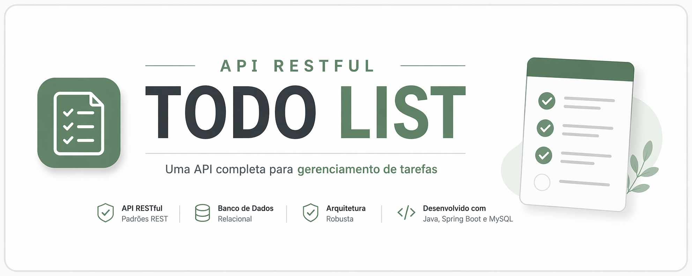

# Todo — Spring Boot & Angular

A full-stack todo application. JWT-authenticated REST API on Spring Boot 3.5 (Java 21) with a standalone Angular 20 client.

## Stack

- **Backend:** Spring Boot 3.5, Spring Security, OAuth2 Resource Server, JPA, Flyway, Bucket4j, Springdoc OpenAPI
- **Frontend:** Angular 20 (standalone components, signals, lazy-loaded routes)
- **Database:** H2 for dev, PostgreSQL for prod
- **Tooling:** Maven, npm, Spotless, ESLint, Prettier, Testcontainers, GitHub Actions, Docker Compose

## Features

- Register, login, logout with JWT (HS256, 32-byte secret enforced)
- Task CRUD with pagination, filters (`all` / `open` / `done`) and per-task loading state
- Custom confirmation modal for destructive actions
- Login rate limiting (Bucket4j, 5 req/min per IP)
- OpenAPI docs at `/swagger-ui.html`, health at `/actuator/health`

## Run it

Copy the environment file and start everything via Docker:

```bash
cp .env.example .env
docker compose up --build
```

- Frontend: http://localhost:4200
- Backend: http://localhost:8080
- Swagger: http://localhost:8080/swagger-ui.html

For local development without Docker:

```bash
./start.command
```

## Project layout

```
backend/   Spring Boot API, Flyway migrations, Testcontainers integration tests
frontend/  Angular 20 app (core, features, shared)
docker-compose.yml
```

## Tests

```bash
cd backend && ./mvnw verify
cd frontend && npm test
```
